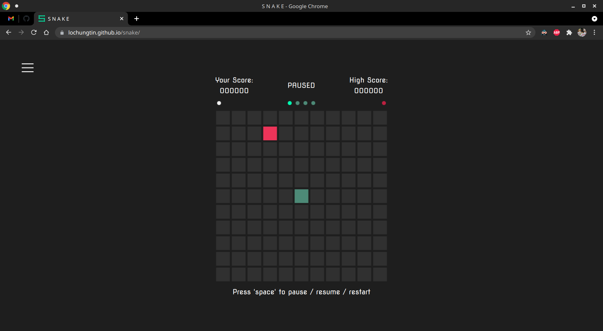
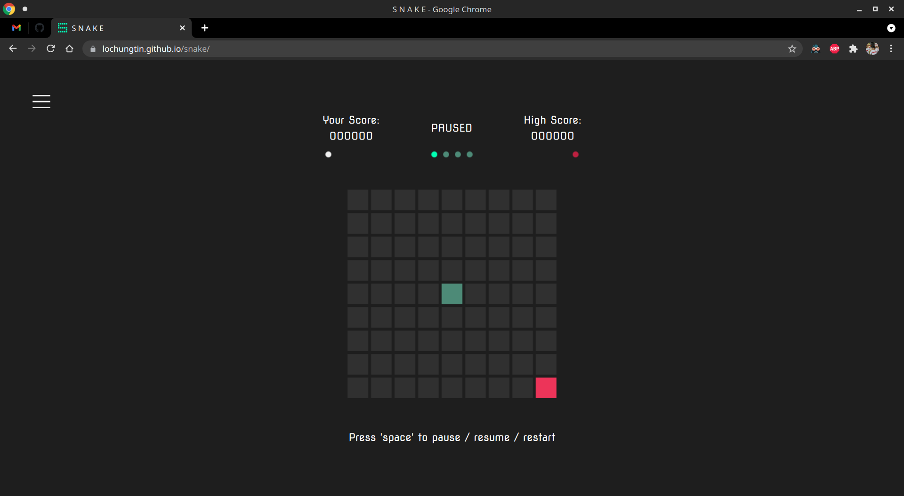
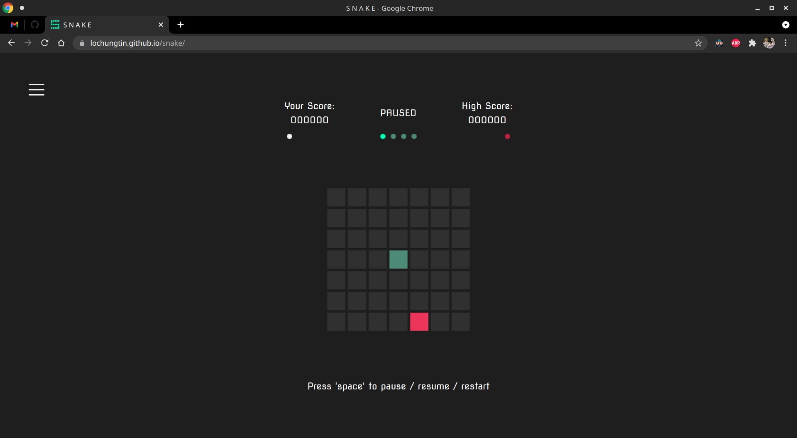
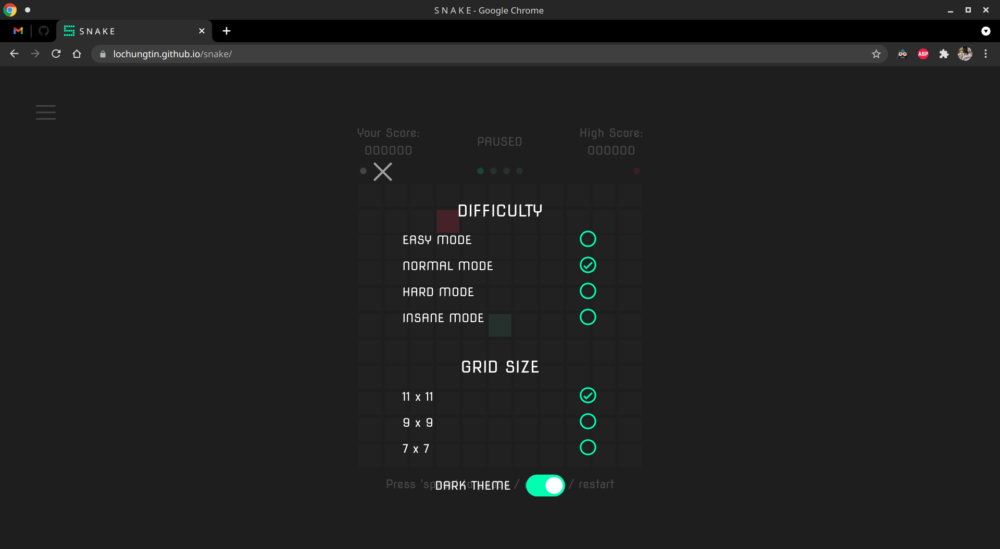
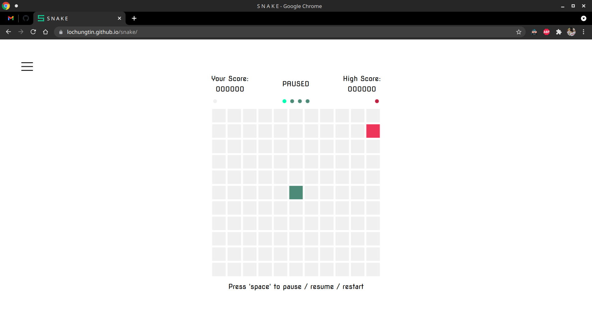
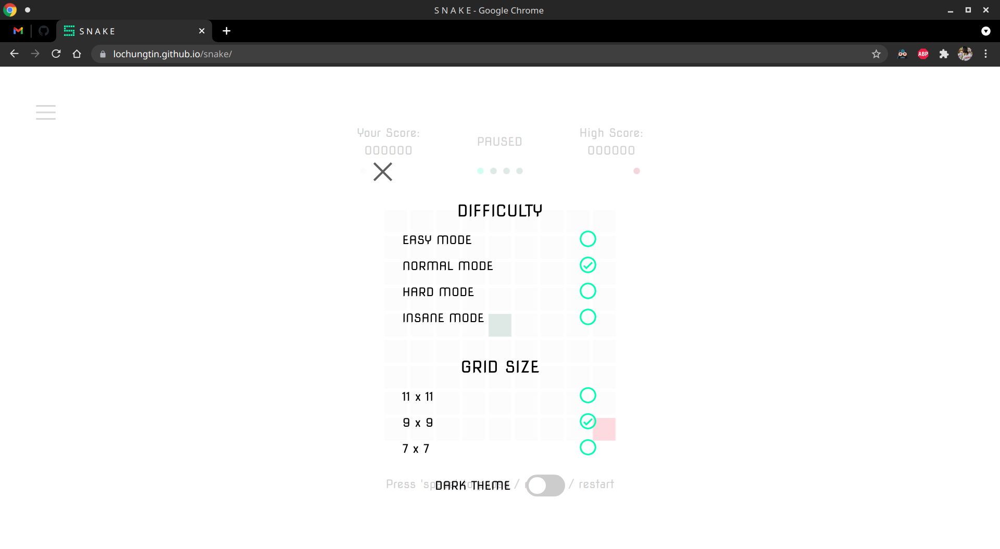

 

# Snake

Simple game of snake coded in static html, js, and css

## Intended use

Create an OpenCV powered reinenforcement learning bot to play a game of snake

## Gallery

|          Dark Mode 11 x 11 Grid (default)           |                     9 x 9 Grid                     |
| :-------------------------------------------------: | :------------------------------------------------: |
|  |  |

|                     7 x 7 Grid                     |                     Setting Menu                      |
| :------------------------------------------------: | :---------------------------------------------------: |
|  |  |

|               Light Mode 11 x 11 Grid               |                     Setting Menu                      |
| :-------------------------------------------------: | :---------------------------------------------------: |
|  |  |

## Game Settings

### Game Speed
1. Easy Mode
   - Frame Speed: 500 ms per frame
   - Score Multiplier: x0
2. Normal Mode (default)
   - Frame Speed: 300 ms per frame
   - Score Multiplier: x1
3. Hard Mode
   - Frame Speed: 100 ms per frame
   - Score Multiplier: x2
4. Insane Mode (indented for AI Training)
   - Frame Speed: 50 ms per frame
   - Score Multiplier: x3

### Grid Size
1. 11 x 11 (default)
2. 9 x 9
3. 7 x 7

## Score Keeping

When the snake eats an orb, a value (depending on difficulty) will be added to the total score. Score calculation has to components, the base score and the multiplied score. The base score is 50 and the multiplied score depends on the selected speed of the game.

### Score Multipliers
The value of the score multiplier is 50, with a base score of 50, the multiplied speed of each difficulty is as follows
- Easy: 50
- Normal: 100
- Hard: 150
- Insane: 200
