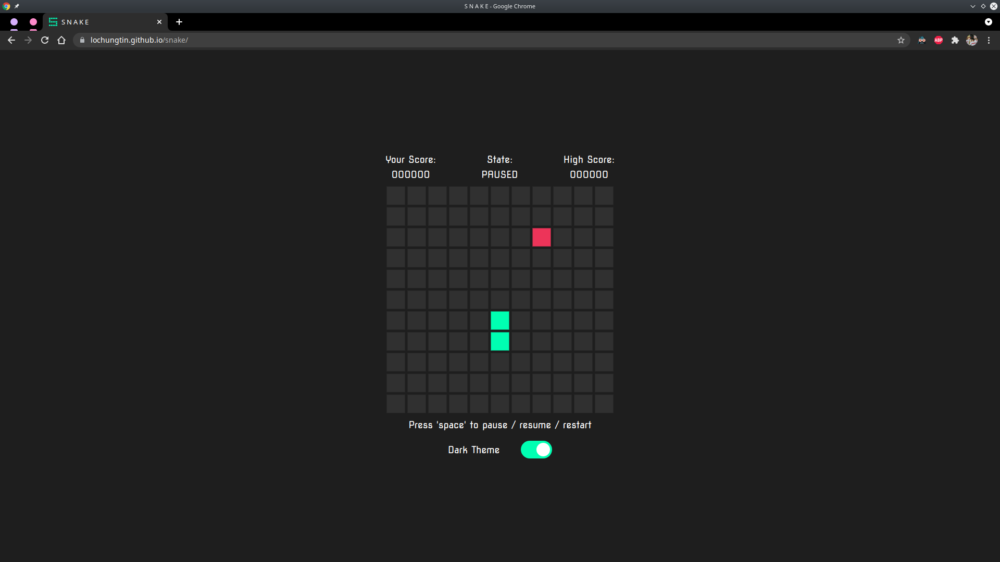

 

# Snake

Simple game of snake coded in static html, js, and css

- with local storage for highscores and dark/light theme toggling

## Intended use

Create an OpenCV powered reinenforcement learning bot to play a game of snake

## Gallery

|                Dark Mode (default)                |
| :-----------------------------------------------: |
|  |

|                     Light Mode                     |
| :------------------------------------------------: |
|  |
